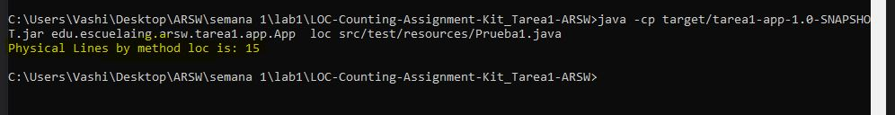

# TAREA 1 ARSW (LOC Counting Assignment Kit)

Write a program to Count the Lines of Code of a source file. The Lines Of Code (LOC) of a program are often used as software metric to compare complexity and to measure productivity

# LOC/h. Rendimiento

1. desde las 11:00 am, hasta las 1:11 pm - fueron en total 184 LOC
1. desde las 1:30 pm, hasta las 4:25 pm - fueron en total 74 LOC
1. desde las 8:20 pm, hasta las 9:31 pm - fueron en total 100 LOC

# Link del Articulo del proyecto

Articulo donde se explica la arquitectura, diseño y pruebas del aplicativo.

[Link Articulo](https://drive.google.com/file/d/14IT4qMXiJTbCUXS5L0VchGpdDZWlI68S/view?usp=sharing)


## EMPEZAR

Copie el proyecto via git clone en cualquier diretorio para empezar a trabajar:
```
git clone https://github.com/vashigo/LOC-Counting-Assignment-Kit_Tarea1-ARSW.git
```

### Prerequisitos

Tener instalado Java jdk versiones 7+, Maven comandos y git

### Instalando

1. Ejecutar en terminal:

```
$$ mvn package
```
2.(opcional):
si requiere a documentacion del codigo ejecute y estara en raiz /target:

```
mvn javadoc:javadoc
```

2. (Demostracion):
  compile el proyecto desde la carpeta raiz ejecutando la siguiente linea dependendiendo del metodo de lectura si es 'loc' o 'phy' que en este caso el comando estara con loc:
  
```
java -cp target/tarea1-app-1.0-SNAPSHOT.jar edu.escuelaing.arsw.tarea1.app.App loc src/test/resources/App.java
```


  

## Built con

* [Maven](https://maven.apache.org/) - Dependency Management
* [JAVA JDK 8](http://www.oracle.com/technetwork/java/javase/overview/index.html) - construcción
* [JUnit 3.8.1](https://mvnrepository.com/artifact/junit/junit/3.8.1) - Test Dependency


## Autor

* **ANDRES DAVID VASQUEZ IBAÑEZ** - *Initial work* - [VASHIGO](https://github.com/vashigo)


## Licencia

This project is licensed under the GNU General Public License - see the [LICENSE](LICENSE) file for details